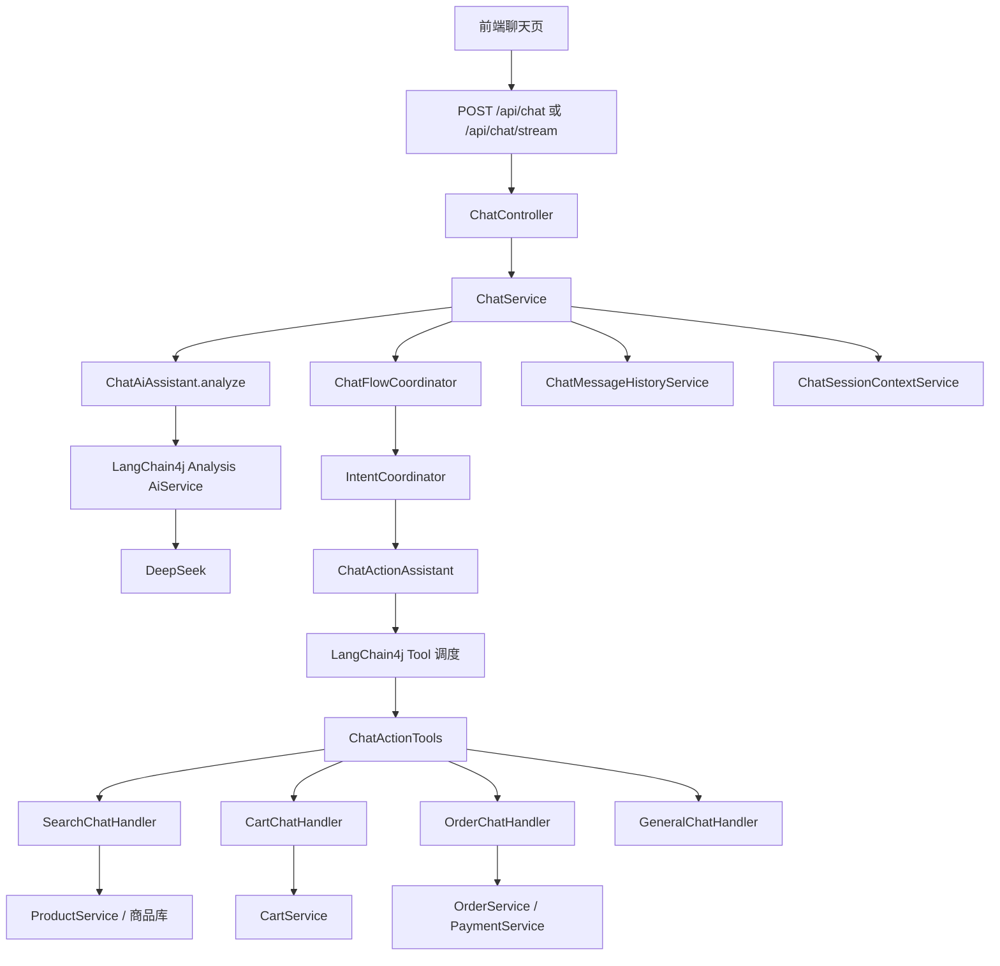

# 当前 AI 功能实现说明

## 1. 文档目的

本文档用于说明当前项目中已经落地的 AI 能力、真实执行链路、前后端交互方式、当前冻结边界，以及目前仍然存在的限制。

本文档只描述当前代码已经实现的内容，不讨论理想方案，不做脱离代码现状的泛化设计。

---

## 2. 当前 AI 模块定位

当前项目中的 AI 模块不是一个完全自治的 Agent 平台，而是一个：

- `LangChain4j + DeepSeek` 驱动的语义分析与工具调度层
- 叠加真实商品库、真实购物车、真实订单、真实支付服务的聊天执行模块

一句话定义：

**AI 负责理解用户意图、生成文案、触发工具执行；真实业务服务负责商品、购物车、订单、支付。**

---

## 3. 当前冻结边界

当前必须遵守的接口与业务边界如下：

### 3.1 聊天接口冻结

- URL 固定：`/api/chat`
- 兼容流式接口：`/api/chat/stream`
- `ChatResponse` 顶层字段不可变：
  - `intent`
  - `message`
  - `products`
  - `orders`
  - `actions`

### 3.2 业务真实性约束

- 商品必须来自真实数据库
- 购物车必须走真实 `CartService`
- 订单必须走真实 `OrderService`
- 支付必须走真实 `PaymentService`
- 不允许 LLM 直接虚构商品或直接修改数据库

### 3.3 当前阶段结构约束

- 不独立拆出仓库级 `ai-module`
- 只在当前 `backend/mall-backend` 内做最小重构
- 不引入复杂多 Agent 平台

---

## 4. 当前后端 AI 核心结构

### 4.1 主要类

- [ChatService.java](/C:/Users/Orion/Desktop/ai-shop/backend/mall-backend/src/main/java/com/mall/service/ChatService.java)
- [ChatFlowCoordinator.java](/C:/Users/Orion/Desktop/ai-shop/backend/mall-backend/src/main/java/com/mall/service/chat/flow/ChatFlowCoordinator.java)
- [ChatAiAssistant.java](/C:/Users/Orion/Desktop/ai-shop/backend/mall-backend/src/main/java/com/mall/service/chat/llm/ChatAiAssistant.java)
- [ChatActionAssistant.java](/C:/Users/Orion/Desktop/ai-shop/backend/mall-backend/src/main/java/com/mall/service/chat/llm/ChatActionAssistant.java)
- [ChatActionTools.java](/C:/Users/Orion/Desktop/ai-shop/backend/mall-backend/src/main/java/com/mall/service/chat/llm/ChatActionTools.java)
- [RuleBasedChatIntentDetector.java](/C:/Users/Orion/Desktop/ai-shop/backend/mall-backend/src/main/java/com/mall/service/chat/intent/RuleBasedChatIntentDetector.java)
- [IntentCoordinator.java](/C:/Users/Orion/Desktop/ai-shop/backend/mall-backend/src/main/java/com/mall/service/chat/intent/IntentCoordinator.java)
- [ChatMemoryService.java](/C:/Users/Orion/Desktop/ai-shop/backend/mall-backend/src/main/java/com/mall/service/chat/memory/ChatMemoryService.java)
- [ChatSessionContextService.java](/C:/Users/Orion/Desktop/ai-shop/backend/mall-backend/src/main/java/com/mall/service/ChatSessionContextService.java)
- [ChatMessageHistoryService.java](/C:/Users/Orion/Desktop/ai-shop/backend/mall-backend/src/main/java/com/mall/service/ChatMessageHistoryService.java)
- [ChatSessionMemoryKey.java](/C:/Users/Orion/Desktop/ai-shop/backend/mall-backend/src/main/java/com/mall/service/chat/llm/ChatSessionMemoryKey.java)
- [ChatResponseFactory.java](/C:/Users/Orion/Desktop/ai-shop/backend/mall-backend/src/main/java/com/mall/service/chat/support/ChatResponseFactory.java)

### 4.2 当前调用链路

---

## 5. 当前已经实现的 AI 能力

## 5.1 基础问答

### 已实现内容

- 支持基础电商问答
- 支持普通引导型回复
- 支持默认动作按钮返回

### 当前行为

- 用户泛化提问时进入 `GENERAL_QA`
- AI 输出回复文案
- 后端返回：
  - `message`
  - `actions`

### 当前动作

当前默认会返回：

- `查看购物车`
- `返回首页`
- `查看订单`

相关代码：

- [ChatResponseFactory.java](/C:/Users/Orion/Desktop/ai-shop/backend/mall-backend/src/main/java/com/mall/service/chat/support/ChatResponseFactory.java)

---

## 5.2 商品搜索

### 已实现内容

- 支持聊天式商品搜索
- 商品始终来自真实数据库
- AI 可参与 `searchQuery` 改写

### 当前行为

- 用户说“我想买手机”“帮我找洗面奶”等
- 系统识别为 `SEARCH_PRODUCT`
- AI 分析后生成搜索语义
- 后端使用真实 `ProductService.searchProducts(...)`
- 返回商品卡片列表

### 返回结果

- `intent = SEARCH_PRODUCT`
- `products`
- `message`
- 默认动作：
  - `加入购物车`
  - `立即购买`

---

## 5.3 商品推荐

### 已实现内容

- 支持推荐型检索
- DeepSeek 参与推荐文案生成
- 推荐结果仍来自真实商品库

### 当前行为

- 用户说“推荐一个适合通勤的包”
- 系统识别为 `RECOMMEND_PRODUCT`
- AI 输出：
  - 推荐意图
  - 搜索改写
  - 推荐文案
- 后端用真实数据库搜索结果返回商品

### 当前准确定位

当前推荐不是 embedding 推荐系统，而是：

**“AI 参与语义理解和推荐解释的真实商品检索推荐。”**

---

## 5.4 加入购物车

### 已实现内容

- 支持直接聊天加购
- 支持通过“第一个 / 第二个 / 第三个”进行商品引用加购
- 支持商品卡片上的“加入购物车”按钮

### 当前行为

- 用户说“加入购物车”
- 用户说“把第二个放到购物车”
- 用户点击聊天商品卡片上的“加购”

系统会：

1. 识别 `ADD_TO_CART`
2. 解析目标商品
3. 调真实 `CartService.addToCart(...)`
4. 返回成功消息和 `查看购物车` 动作

### 已修正点

当前已支持这些表达稳定命中 `ADD_TO_CART`：

- `加入购物车`
- `加购物车`
- `加购`
- `放到购物车`
- `放进购物车`
- `放购物车`

---

## 5.5 立即购买

### 已实现内容

- 支持聊天直接购买
- 支持“第一个 / 第二个 / 第三个”商品引用购买
- 支持商品卡片上的“购买”按钮

### 当前行为

- 用户说“买这个”
- 用户说“买第三个”
- 用户点击商品卡片“购买”

系统会：

1. 识别 `BUY_NOW`
2. 解析目标商品
3. 调真实 `OrderService.createBuyNowOrder(...)`
4. 拉取真实订单详情
5. 弹出统一 `PaymentConfirmModal`
6. 用户确认后调用 `/payments/create`
7. 再跳转支付宝

---

## 5.6 查看购物车

### 已实现内容

- 支持聊天里进入购物车
- 支持动作按钮跳转购物车页

### 当前行为

- 用户说“查看购物车”
- 或点击 `查看购物车`

系统返回：

- 文案提示
- `GO_CART` 动作

前端再跳转 `/cart`

---

## 5.7 查看订单

### 已实现内容

- 支持聊天查看订单
- 支持返回未支付订单
- 支持订单列表卡片展示

### 当前行为

- 用户说“查看订单”
- 系统识别 `VIEW_ORDER`
- 调真实 `OrderService.getOrders(...)`
- 返回订单卡片和动作：
  - `立即支付`
  - `查看订单`

---

## 5.8 支付引导

### 已实现内容

- 支持聊天进入支付引导
- 支持未支付订单直接支付

### 当前行为

- 用户说“去支付”“继续支付”
- 系统识别 `PAY_GUIDE`
- 拉取未支付订单
- 返回可支付订单与 `PAY_NOW`

---

## 5.9 流式输出

### 已实现内容

- 已有基础流式接口：`POST /api/chat/stream`
- 前端支持消费 SSE 风格数据

### 当前事件类型

- `stage`
- `status`（兼容保留）
- `complete`
- `error`

### 当前能力边界

- 当前是“真实业务阶段流”，不是最终 message 的伪切片输出
- 仍然不是底层 token 级模型流

### 当前阶段示例

- `REQUEST_RECEIVED`
- `ANALYZING`
- `INTENT_RESOLVED`
- `EXECUTING_ACTION`
- `PERSISTING`
- `RESPONSE_READY`

相关代码：

- [ChatController.java](/C:/Users/Orion/Desktop/ai-shop/backend/mall-backend/src/main/java/com/mall/controller/ChatController.java)
- [ChatStreamEvent.java](/C:/Users/Orion/Desktop/ai-shop/backend/mall-backend/src/main/java/com/mall/dto/chat/ChatStreamEvent.java)
- [chat.js](/C:/Users/Orion/Desktop/ai-shop/frontend/src/services/chat.js)

---

## 5.10 Session 级记忆

### 已实现内容

- 按 `userId + sessionId` 保存会话上下文
- 按 `userId + sessionId` 保存完整消息历史
- 前端支持多会话侧边栏

### 当前后端存储

1. `chat_session_context`

保存：

- 最近 intent
- 最近用户消息
- 最近商品 ID 列表
- 最近订单号

2. `chat_message_history`

保存：

- 用户消息
- AI 最终回复

### 当前能力

- 支持“第一个 / 第二个 / 第三个”
- 支持同一会话内连续加购、连续购买、继续支付
- 支持删除会话时同时清空：
  - session context
  - message history
  - 内存缓存（LangChain4j chat memory）

---

## 5.11 会话删除

### 已实现内容

- 前端可删除聊天会话
- 后端提供删除接口
- 删除时同时清理本地缓存和服务端 session 数据

### 当前接口

- `DELETE /api/chat/{sessionId}`

### 当前行为

- 前端删除侧边栏会话
- 删除当前用户命名空间下的本地 `localStorage/sessionStorage` 会话与消息
- 删除后端：
  - session context
  - message history
  - chat memory 缓存

---

## 5.12 订单删除

### 已实现内容

- 订单页支持删除订单
- 后端支持删除订单
- 同时删除支付记录

### 当前接口

- `DELETE /api/orders/{orderNo}`

### 当前行为

- 只允许删除当前用户自己的订单
- 删除订单时同时删除关联支付记录
- 已做幂等化处理：资源不存在时按“已删除”处理

---

## 5.13 支付确认层

### 已实现内容

- 首页购买前展示支付确认层
- 购物车结算前展示支付确认层
- 订单页支付前展示支付确认层
- 聊天支付前展示支付确认层

### 当前行为

- 创建订单后先拉订单详情
- 弹出前端确认层
- 用户确认后调用 `/payments/create`
- 再跳转支付宝

相关代码：

- [PaymentConfirmModal.vue](/C:/Users/Orion/Desktop/ai-shop/frontend/src/components/PaymentConfirmModal.vue)

---

## 5.14 购物车结算删除已结算项

### 已实现内容

- 购物车结算创建订单后，会删除本次参与结算的购物车项

### 当前行为

- 用户在购物车勾选多个商品
- 点击结算
- 后端创建订单
- 删除本次 `cartItemIds`
- 前端刷新购物车

这样可以避免重复点击结算导致同一批购物车项反复生成订单。

---

## 6. 当前前端主要体验形态

当前前端已经具备：

- 聊天页多会话侧边栏
- 聊天本地缓存按用户隔离（切换账号不串会话）
- 会话切换默认滚到底部
- 聊天商品卡片
- 聊天订单卡片
- 聊天动作按钮
- 支付确认层
- 支付结果页真实订单摘要（订单号、支付状态、总金额、商品列表）
- 订单页支付/删除
- 购物车页结算后直接进入支付链路

---

## 7. 当前已知限制

## 7.1 仍依赖当前会话上下文正确维护

“第一个 / 第二个 / 第三个” 的前提是：

- 当前 userId + sessionId 对应上下文里最近商品列表正确

如果某个历史会话在旧逻辑下写入过错误商品列表，建议删除旧会话后重试。

## 7.2 流式输出不是 token 级

当前是业务阶段流，不是底层模型 token streaming。

## 7.3 前端会话列表仍以本地数据为主

当前会话列表和消息切换主要依赖浏览器本地存储；后端虽然已经存了消息历史，但前端还没有完全改成以后端为主的数据源。

## 7.4 推荐能力仍不是完整推荐系统

当前没有：

- embedding 检索
- rerank
- 长期偏好画像
- 显式推荐策略层

---

## 8. 当前最容易误解的点

### 8.1 “看到的商品”和“memory 里的最近商品列表”不是一回事

前端截图中展示的是当前消息返回的商品卡片。  
“第一个 / 第二个 / 第三个” 的解析依赖的是后端 session context 中保存的最近商品 ID 列表。

如果旧 session 的上下文脏了，可能会出现：

- 页面上看到的是 A
- 后端按 ordinal 实际操作的是 B

当前已经修复了主要写错 memory 的逻辑，但旧脏 session 仍建议删除重建。

### 8.2 Session 隔离不等于自动清空上下文

当前是按 `userId + sessionId` 隔离 memory，而不是每轮问答自动重置。

同一个 session 中的历史上下文会持续影响后续“这个 / 第 N 个 / 继续支付”等表达。

---

## 9. 当前状态总结

当前项目已经完成的 AI 闭环包括：

- 基础问答
- 商品搜索
- 推荐商品
- 加入购物车
- 立即购买
- 查看购物车
- 查看订单
- 支付引导
- 流式输出阶段版
- Session 级记忆
- 多会话侧边栏
- 聊天本地缓存用户隔离
- 会话删除
- 订单删除
- 支付确认层
- 支付结果页订单摘要
- 购物车结算后清空已结算项

---

## 10. 最近新增验证用例

后端已补充针对本轮改动的回归测试（`ChatServiceTest`）：

- 双用户使用相同 `sessionId` 不串话
- 删除会话后再次引用“第一个/第二个”会返回正确错误

一句话结论：

**当前 AI 模块已经具备电商聊天闭环的基础能力，重点不再是“能不能跑”，而是“如何继续提升上下文稳定性、前后端一致性和审查能力”。**
